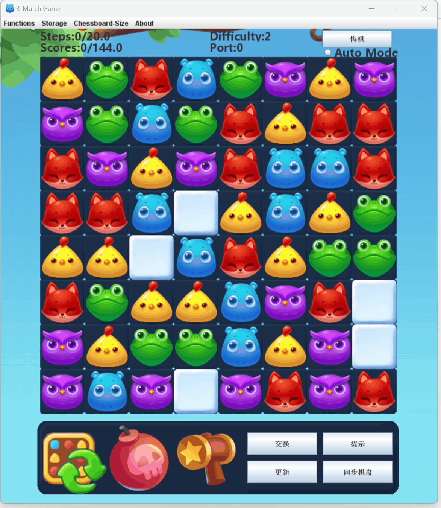

# 🏫 SUSTech CS109 23Fall 期末项目 - 开心消消乐 (Match-3)

  <strong>纯基于 Java Swing 的三消游戏，不使用课程提供的框架。</strong> 
  包含丝滑的动画效果和在线联机模式。

📖 Language: **中文** | [English](README.md)

### 🎮 游戏演示 (Gameplay Demo)

| 基础交互 | 掉落与消除动画 |
| :---: | :---: |
|  |  |

## 📖 简介

本项目是南科大 CS109 课程的大作业，最终得分 **110+**（其实分数溢出了，但上限只给到 110）。

我们两个人完全从零开始构建了游戏的逻辑和 UI，没有依赖学校给的那个半成品 Demo。把代码放出来主要是为了大家学习交流。

> **注意：** 仅供参考，计算机系对抄袭有严厉的惩罚机制。

---

## 🛠️ 如何运行（避坑指南）

### 1. 环境要求
*   **IDE:** 推荐使用 IntelliJ IDEA。
*   **JDK 版本:** **强烈建议使用 Java 8 (1.8)**。
    *   *开发环境:* Java 1.8.0_281。
    *   *兼容性提醒:* 如果你用的是 JDK 11/17/21 等高版本，可能会出现动画忽快忽慢或者图片显示等瑕疵，不过可以保证运行。

### 2. 导入项目
为了防止图片加载不出来，请务必按照以下步骤打开：
1.  打开 IntelliJ IDEA。
2.  点击 `File` -> `Open`。
3.  **一定要选中那个叫 `Project` 的文件夹**（就是里面包含 `src` 的那一层）作为项目根目录打开。
    *   *排错:* 如果运行main程序但是没有画面，请检查路径。

---

## 💡 项目亮点

在这个项目里你能参考什么？

1.  **纯 Swing 搓出来的动画:** 我们完全基于 `JFrame` 实现了非常丝滑的动画效果。这不需要使用额外的游戏引擎，也不用超纲的知识，只用 JavaA 学的内容也能做出很好的视觉效果。
2.  **精致的 UI 设计:** 我们在游戏外观上下了不少功夫，或许能给你做 UI 设计时提供一点思路。
3.  **在线联机功能:** 我们用 Java Socket 写了一个简易的联机模式。代码展示了如何在两个客户端之间同步棋盘状态。

---

## 🔗 链接与联系

*   **演示视频:** [Bilibili 链接](https://www.bilibili.com/video/BV1894y1F7XK/)
*   **联系方式:** 如果想对这个项目讨论，可以发邮件给 `12312710@mail.sustech.edu.cn`，或者在这里提issue。

  
如果这个仓库对你有帮助，请给一个 ⭐️ <strong>Star</strong>！

